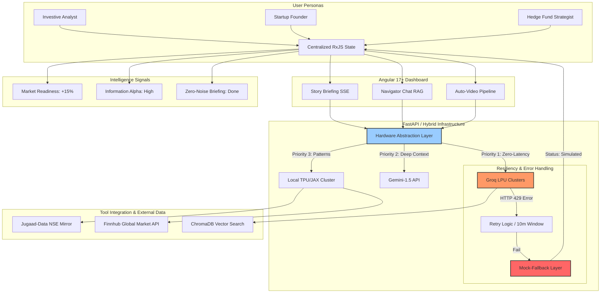

# Aureum Terminal: Architecture & Logic Flow 🌊

The following diagram illustrates how **Aureum Terminal** orchestrates intelligence from the **User Persona** level down to the **Hardware Abstraction Layer (HAL)** and its resilient error-handling logic.

---

## 🏗️ The Intelligence Pipeline

---

## 🛠 Flow Logic Deep-Dive

### 1. User Engagement (The Start)
Whether the persona is an **Investor** tracking market volatility or a **Founder** monitoring competitive shifts, the **Angular Dashboard** uses a synchronized `DashboardStateService` to ensure all UI cards (Hero, Radar, Navigator) update from a single source of truth.

### 2. The HAL Routing
Instead of hardcoding APIs, the backend uses a **Hardware Abstraction Layer (HAL)**. If character-by-character streaming is needed, the request is routed to the **Groq LPU**. If complex, high-context synthesis is required, it shifts to **Gemini**.

### 3. Resilience & Error Handling
To maintain **Production-Grade Uptime**, our system includes a specialized **Fallback Block**:
*   **Retry Logic**: Attempts 2-3 retries for minor timeouts.
*   **Mock-Fallback**: If the user reaches their Daily Rate Limit (`429`), the system instantly shifts to **Mock Intelligence Generation**. This ensures the UI remains functional and informative even during cloud-service outages.

### 4. Tool Integration
We built custom connectors for:
*   **`jugaad-data`**: Specifically for Indian NSE/BSE mirrors.
*   **`finnhub`**: For global NASDAQ and NYSE liquidity metrics.
*   **`ChromaDB`**: As our semantic vector storage for RAG-driven chat.
